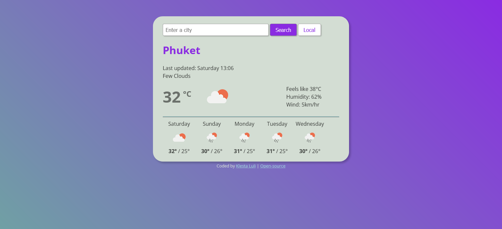

# Weather App

## Table of contents

- [Overview](#overview)
  - [The challenge](#the-challenge)
  - [Screenshot](#screenshot)
  - [Links](#links)
- [My process](#my-process)
  - [Built with](#built-with)
  - [What I learned](#what-i-learned)
  - [Continued development](#continued-development)

## Overview

### The challenge

Users should be able to:

- View the current weather and forecast for:
  - default city,
  - a city they can search for
  - current location

### Screenshot

### Links

- Live Site URL: (https://zen-hopper-212e29.netlify.app/)

## My process

### Built with

- HTML5 markup
- CSS custom properties
- Flexbox
- Vanilla JavaScript
- API integration

### What I learned

I learned to use the forEach loop to copy each forecast day multiple times. I also learned how to convert Unix day to a legible format.

### Continued development

I would like to add error handling to the API calls and continue working with APIs.
